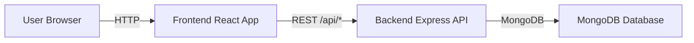
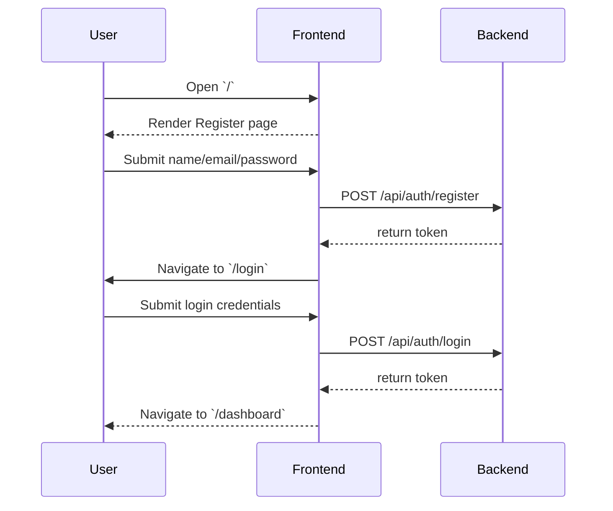

# FeedForge

**FeedForge** is an AI-powered RSS aggregator with a premium, glassmorphic dashboard UI.
It includes user authentication, RSS feed management, article browsing, and AI-generated summaries.

## 🎨 Design System

### Colors
- **Background**: `#020617`
- **Surface**: `#0F172A`
- **Card**: `rgba(255,255,255,0.05)`
- **Primary Gradient**: `linear-gradient(135deg, #3B82F6, #8B5CF6)`
- **Accent Glow**: `#22D3EE`

### Text
- **Primary**: `#E2E8F0`
- **Secondary**: `#94A3B8`
- **Muted**: `#64748B`

### Spacing Scale
- `4`, `8`, `12`, `16`, `24`, `32` (Tailwind units)

### Typography Hierarchy
- **Heading**: Bold, large scale
- **Subheading**: Medium weight
- **Body**: Regular weight
- **Caption**: Small, muted

### Shadows
- Soft glow shadows using `rgba(59,130,246,0.35)` and `rgba(139,92,246,0.2)`

## 🔧 Tech Stack

- Frontend: React + Vite + Tailwind CSS + Framer Motion
- Backend: Node.js + Express + MongoDB + JWT authentication
- API client: Axios

## 🚀 Project Overview

This repository contains two main apps:

- `backend/` - Express API, auth, feed/article storage, summary integration
- `frontend/` - React dashboard, auth pages, feed management, article summarization

## 📁 Folder Structure

```
feedforge/
├─ backend/
│  ├─ src/
│  │  ├─ config/
│  │  ├─ controllers/
│  │  ├─ docs/
│  │  ├─ jobs/
│  │  ├─ middlewares/
│  │  ├─ models/
│  │  ├─ routes/
│  │  ├─ services/
│  │  ├─ utils/
│  │  ├─ validators/
│  │  ├─ app.js
│  │  └─ server.js
│  ├─ package.json
│  └─ .env
├─ frontend/
│  ├─ src/
│  │  ├─ components/
│  │  │  ├─ layout/
│  │  │  │  ├─ AnimatedBackground.jsx
│  │  │  │  ├─ Sidebar.jsx
│  │  │  │  └─ Navbar.jsx
│  │  │  ├─ ui/
│  │  │  │  ├─ Button.jsx
│  │  │  │  ├─ Card.jsx
│  │  │  │  └─ Loader.jsx
│  │  │  └─ features/
│  │  │     └─ SummaryPanel.jsx
│  │  ├─ pages/
│  │  │  ├─ Login.jsx
│  │  │  ├─ Register.jsx
│  │  │  ├─ Dashboard.jsx
│  │  │  ├─ Articles.jsx
│  │  │  └─ ArticleDetail.jsx
│  │  ├─ services/
│  │  ├─ App.jsx
│  │  └─ main.jsx
│  ├─ package.json
│  └─ tailwind.config.cjs
└─ README.md
```

## ⚙️ How to Run Locally

### 1. Backend

```bash
cd backend
npm install
npm run dev
```

The backend listens on `http://localhost:5000` by default.

### 2. Frontend

```bash
cd frontend
npm install
npm run dev
```

The frontend runs on `http://localhost:5173` by default.

> Make sure the backend is running first so frontend API requests succeed.

## 🧩 Environment Variables

Create or update `backend/.env`:

```env
MONGO_URI=mongodb://localhost:27017/feedforge
PORT=5000
JWT_SECRET=mySuperSecretKey123
OLLA_MODEL=mistral:latest
```

## 🏗️ Architecture



## 🔁 User Flow

1. User lands on default `/` register page
2. After successful registration, user is redirected to `/login`
3. After successful login, user is redirected to `/dashboard`



## 🧠 Features

### Backend
- JWT-based registration and login
- MongoDB user, feed, article models
- Feed CRUD: add/delete RSS sources
- Article listing with search support
- AI summary generation endpoint
- Environment-aware config

### Frontend
- Modern dashboard UI with glassmorphism
- Sidebar navigation and responsive collapse
- Default register page
- Login page with redirect to dashboard
- Dashboard stats + latest article preview
- Feeds page with add/delete feed cards
- Articles page with search and summary actions
- Animated UI using Framer Motion

## 🌐 API Endpoints

| Method | Endpoint | Purpose |
|---|---|---|
| POST | `/api/auth/register` | Create user account |
| POST | `/api/auth/login` | Authenticate user |
| GET | `/api/feeds` | List all feeds |
| POST | `/api/feeds` | Add a new feed |
| DELETE | `/api/feeds/:id` | Remove a feed |
| GET | `/api/articles` | Fetch articles |
| GET | `/api/articles/search?q=` | Search articles |
| POST | `/api/summary` | Generate article summary |

## 🧠 Frontend Page Map

- `/` or `/register` — registration page
- `/login` — login page
- `/dashboard` — dashboard view
- `/feeds` — feed management view
- `/articles` — article list view

## 🛠️ Development Workflow

1. Start backend (`backend/npm run dev`)
2. Start frontend (`frontend/npm run dev`)
3. Register a new user
4. Login with the new user
5. Add RSS feeds from the Feeds page
6. Browse and summarize articles from Articles or Dashboard

## ✅ Notes

- The frontend default route intentionally shows the register page.
- Auth pages use a separate layout without sidebar chrome.
- Dashboard and app pages render after successful login.
- The backend must be running before using the frontend.

## 📦 Build

To create a production frontend bundle:

```bash
cd frontend
npm run build
```

To deploy the backend, run:

```bash
cd backend
npm start
```

## 💡 Helpful Tips

- If you see `ERR_CONNECTION_REFUSED`, ensure the backend is running on port `5000`.
- If login/register redirects are broken, check `frontend/src/App.jsx` for auth route logic.

---

Built for a smooth, minimal, futuristic RSS & AI dashboard experience.
